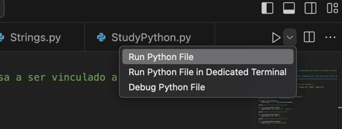

# Introdução à linguagem Python

É possível executar os arquivos no Visual Studio Code com a
extensão [Python](https://marketplace.visualstudio.com/items?itemName=ms-python.python).


## Python 2 vs. Python 3

Não muda muita coisa na prática. Python 3 possui melhor performance. Quanto a sintaxe, destaco apenas dois pontos:

1) Comando print( )
   Ao executar o print, em Python 3, os parênteses passam a ser obrigatórios:

```python
    # Python 2
    print "Olá mundo"
    # Python 3
    print("Olá mundo")
```

2) Comando input( )
   Em Python 2 há duas variações do comando input:

```python
    raw_input( ) #strings
    input( ) # valores numéricos
```

Em python 3, deve-se usar apenas input( ) para strings, e para números deve-se combinar com as funções float ou int.
Veja:

### Recebendo textos

`meu_texto = input("Digite um texto: ")`

### Recebendo números

```python
    numero_inteiro = int(input("Digite um numero inteiro: "))
    numero_decimal = float(input("Digite um numero decimal: "))
```

## Conceitos fundamentais

### Operações matemáticas

Arquivo [StudyPython.py](StudyPython.py).

```python
    print("4 + 2 =", 4 + 2)
    print("4 - 2 =",4 - 2)
    print("40 / 2 =", 40 / 2)
    print("5 * 2 =", 5 * 2)

    print("2 elevado a 3 (exponencial) =", 2 ** 3)
    print("Módulo de 10 % 3 (resto) =", 10 % 3)
```

### Operadores Lógicos

Arquivo [StudyPython.py](StudyPython.py).

```python
    x = 3
    y = 4
    print("x é igual a y?", x == y)
    print("x maior que y?", x > y)
    z = 5
    print("AND", x == y and x == z)
    print("OR", x == y or x == z)
```

### Operador Condicional

O `elif` informa "se a condição anterior não foi verdadeira, tente essa nova condição".
Arquivo [StudyPython.py](StudyPython.py).

```python
    a = 23
    b = 43
    if a > b:
        print("a é maior que b.")
    elif a == b:
        print("a e b são iguais.")
    elif a < b:
        print("a é menor que b.")
    else:
        print("Não sei...")
```

### Estruturas de repetição

Arquivo [LacosDeRepeticao.py](LacosDeRepeticao.py).

```python
x = 1
while x < 10:
    print("while", x)
    x += 1

lista_numeros = [1,2,3,4,5]
lista_strings = ["ola", "viagem", "prova"]
lista_multipla = [0, "ola", "biscoito", 9.89, True]

for numero in lista_numeros:
    print("for", numero)

for var in lista_multipla:
    print("outro for", var)

for i in range(10): # range inicia no Zero
    print("range() inicia em zero:", i)

for i in range(10, 20): # inicia em 10 até (20-1)
    print("range(primeiro_numero, ultimo + 1: ", i)

for i in range(10, 20, 2): # inicia em 10 até (20-1)
    print("range(primeiro_numero, ultimo + 1, intervalo: ", i)
    
```

### Strings

Algumas funções para manipulação de strings. Arquivo [Strings.py](Strings.py).

```python
    k = kamila
    s = serpa
    
    print("Concatenação:", k + " " + s)
    print("Tamanho da string:", len(concatenacao))

    print(k[0]) # K
    # print(k[10]) # IndexError: string index out of range

    print("k[0:4] do índice 0 (incluindo) até o 4 (excluindo) ->", k[0:4]) # Kami
    print("string.capitalize ->", k.capitalize())
    print("string.upper ->", k.upper())
    print("string.lower ->", k.lower())

    print("string.strip (remove espaços em branco no início e final) ->", "  teste\n".strip())
    print("string.strip (remove caracteres selecionados) ->", ",,,  !teste\n.jpg".strip(" !,.jpg"))
    print("A variável continua com o valor inicial pois não houve atribuição ->", k)

    minha_string = "O rato roeu a roupa do rei de Roma"
    minha_lista = minha_string.split("r")
    print("Removeu a letra escolhida para a separação, menos o R maiúsculo (pois é case sensitive):", minha_lista)
    # ['O ', 'ato ', 'oeu a ', 'oupa do ', 'ei de Roma']

    busca_rei = minha_string.find("rei")
    print("Índice da palavra 'rei'(find):", busca_rei) # 23

    print("Imprime o índice de 'rei' até o final: 'minha_string[busca_rei:]' :", minha_string[busca_rei:])

    busca_rainha = minha_string.find("rainha")
    print("Índice da palavra não encontrada retorna -1:", busca_rainha)

    print(minha_string.replace("rei", "rainha")) # O rato roeu a roupa do rainha de Roma
```

### Manipulação de arquivos

A função `open()` abre um arquivo e o retorna como um objeto.
Arquivo [ManipulacaoDeArquivos.py](ManipulacaoDeArquivos.py).

```python
    arquivo2 = open("arquivo2.txt", "w") # abre arquivo apagando seu conteúdo, caso não exista cria o arquivo
    arquivo2.write("Esse é o meu segundo arquivo gerado via linha de código.\n")
    arquivo2.close()

    arquivo = open("arquivo.txt", "a") # abre arquivo, mantém o conteúdo atual e adiciona ao final o conteúdo do .write
    arquivo.write("Adicionando conteúdo ao meu arquivo gerado via linha de código.\n")
    arquivo.close()

    arquivo = open("arquivo.txt")

    print("Todo o conteúdo:", arquivo.read()) # lê arquivo completo
```

### Listas

Algumas funções. Arquivo [Lists.py](Lists.py).

```python
    lista_frutas = ["manga", "acerola", "morango", "abacate", "kiwi", "caju"]
    lista_frutas.sort() # ordena alfabeticamente
    lista_frutas.append("limao") # adiciona item à lista
    del lista_frutas[4:] # remove o índice 4 e os próximos
    del lista_frutas[2] # remove o índice 2
    del lista_frutas[:] # remove tudo

    lista_numeros = [124,345,5,72,46,6,7,3,1,0]
    sorted(lista_numeros) # retorna a lista recebida como parâmetro ordenada, porém não a altera

    lista_numeros.sort() # ordena numericamente, crescente
    lista_numeros.sort(reverse=True) # ordena decrescente
    lista_numeros.reverse() # coloca os itens em ordem reversa
```

### Dicionários

São estruturas de chave e valor copm a sintaxe: `chave1: valor1, chave2: valor2, ...}`.
Arquivo [Dicionarios.py](Dicionarios.py).

```python
    meu_dicionario = {"A": "ameixa", "B": "bola", "C" : "cachorro"}
    print("meu_dicionario['A']:", meu_dicionario["A"])

    for chave in meu_dicionario:
        print(chave + " -> " + meu_dicionario[chave])
    for i in meu_dicionario.items():
        print("items:", i) # items: ('A', 'ameixa') ...

    for k in meu_dicionario.keys():
        print("keys:", k) # keys: A ...

    for v in meu_dicionario.values():
        print("values:", v) # values: ameixa ...
```

### Tratamento de exceções

Arquivo [Excecoes.py](Excecoes.py).

```python
    try:
        print(a/b)
    except:
        print("Não é permitida divisão por 0.")
```

## Tópicos avançados em Python

### list comprehension

```python
    fruits = ["apple", "banana", "cherry", "kiwi", "mango"]
    newlist = [x for x in fruits if "a" in x]
    print(newlist) # ['apple', 'banana', 'mango']
```

### map

Excecuta uma função para cada item de uma lista. O item é enviado para a função como parâmetro.
Arquivo [Map.py](Map.py):

```python
    def dobro(x):
        return x * 2

    valores_dobrados = map(dobro, [1,2,3,4,5])

    print(list(valores_dobrados)) # [2, 4, 6, 8, 10]
```

### reduce

A função `reduce(fun, seq)`` é usada para aplicar uma função específica passando em seu argumento todos os elementos da
lista mencionados na sequência transmitida. Esta função é definida no módulo “functools”.
Arquivo [Reduce.py](Reduce.py):

```python
    from functools import reduce
    lista = [1,3,5,10,20]
    def soma(x,y):
        return x + y

    soma_lista = reduce(soma, lista)
    print(soma_lista) # 39
```

### zip

A função zip() retorna um objeto zip, que é um iterador de tuplas onde o primeiro item em cada iterador passado é
emparelhado e, em seguida, o segundo item em cada iterador passado é emparelhado, etc.

Se os iteráveis passados tiverem comprimentos diferentes, o iterável com menos itens decidirá o comprimento do novo
iterador.
Arquivo [Zip.py](Zip.py):

```python
    lista_numerica = [1, 2, 3, 4, 5]
lista_nomes = ["avião", "bola", "cachorro"]
lista_valores = ["R$ 500,00", "R$ 20,00", "R$ 40,00"]

for numero, nome, valor in zip(lista_numerica, lista_nomes, lista_valores):
    print(numero, nome, valor)

# 1 avião R$ 500,00
# 2 bola R$ 20,00
# 3 cachorro R$ 40,00
```

### filter

A função `filter()` retorna um iterador onde os itens são filtrados através de uma função para testar se o item é aceito
ou não.
Arquivo [Filter.py](Filter.py):

```python
    idades = [5, 12, 17, 18, 24, 32]

    def maioridade(x):
    if x < 18:
        return False
    else:
        return True

    adults = filter(maioridade, idades)

    for x in adults:
    print(x)
```

### Teste Unitário

Testando a função `soma(a,b)` e `multiplicacao(a,b)` do arquivo [StudyPythonFunctions.py](StudyPythonFunctions.py)

```python
    import unittest
    import StudyPythonFunctions

    class TestStudyPythonFunctions(unittest.TestCase): # herança
        def test_soma(self):
            result = StudyPythonFunctions.soma(25,6)
            self.assertEqual(result, 31)

        def test_multiplicacao(self):
            result = StudyPythonFunctions.multiplicacao(3,4)
            self.assertEqual(result, 12)

    if __name__ == '__main__':
        unittest.main()
```

## Lista de exercícios I

1. Faça um programa que receba a idade do usuário e diga se ele é maior ou menor de idade.

2. Faça um programa que receba duas notas digitadas pelo usuário. Se a nota for maior ou igual a seis, escreva aprovado,
   senão escreva reprovado.

3. Escreva um programa que resolva uma equação de segundo grau.

4. Escreva um programa que ordene uma lista numérica com três elementos.

5. Escreva um programa que receba dois números e um sinal, e faça a operação matemática definida pelo sinal.

Resoluções em [lista_exercicios_1](lista_exercicios_1).

## Developer
[Kamila Serpa](https://kamilaserpa.github.io)

[1]: https://www.linkedin.com/in/kamila-serpa/
[2]: https://gitlab.com/java-kamila
[3]: https://github.com/kamilaserpa

[][1]
[][2]
[][3]
